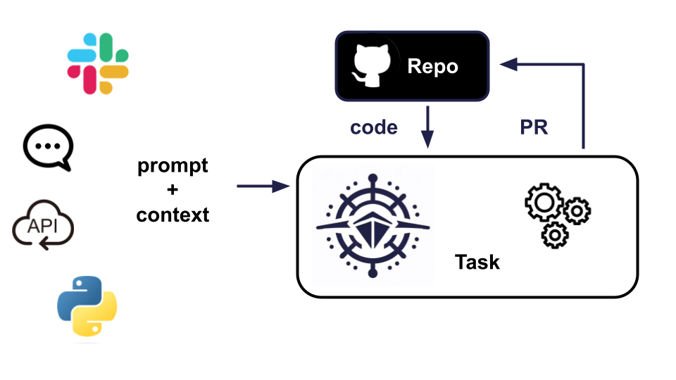
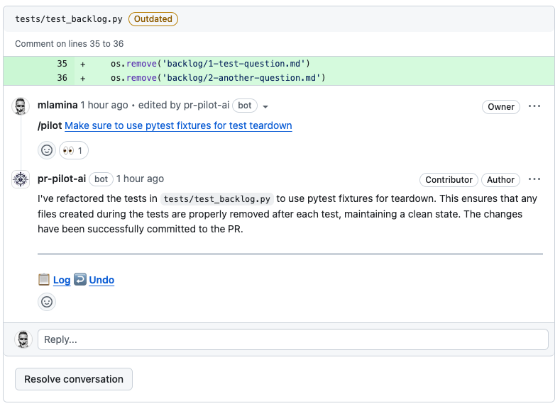

<div align="center">

</div>

<p align="center">
  <a href="https://github.com/apps/pr-pilot-ai/installations/new"><b>Install</b></a> |
  <a href="https://docs.pr-pilot.ai">Documentation</a> | 
  <a href="https://www.pr-pilot.ai/blog">Blog</a> | 
  <a href="https://www.pr-pilot.ai">Website</a>
</p>


# 🤖 PR Pilot

A platform that enables developers to create agentic workflows for Github projects.


Get started now with our [User Guide](https://docs.pr-pilot.ai/user_guide.html).




### Automate your Github project in new and powerful ways

#### Using **[Smart Actions](https://github.com/PR-Pilot-AI/smart-actions)**:

```yaml
# .github/workflows/issue_formatter.yaml`

name: Let AI Agent format and label every new issue
on:
  issues:
    types: [opened]

jobs:
  format-issue:
    runs-on: ubuntu-latest
    steps:
      - name: Format GitHub Issue
        uses: PR-Pilot-AI/smart-actions/format-issue@v1
        with:

          # API key for PR Pilot must be defined as a secret in the repository
          api-key: ${{ secrets.PR_PILOT_API_KEY }}

          # Number of the issue to be formatted
          issue-number: ${{ github.event.issue.number }}

          # Customize the instructions to your needs
          formatting-instructions: |
            - Ensure the title begins with an appropriate emoji
            - Issue body should be properly Markdown-formatted
            - If the issue has no labels, add some
```

#### Using the **[Python SDK](https://github.com/PR-Pilot-AI/pr-pilot-python)**:

```python
import time

from pr_pilot.util import create_task, get_task

github_repo = "PR-Pilot-AI/pr-pilot"
task = create_task(github_repo, "Summarize the README file and create a Github issue with the result.")

while task.status != "completed":
    print(f"Waiting for task to complete. Status: {task.status}")
    task = get_task(task.id)
    time.sleep(5)
    
print(f"Task completed. Result:\n\n{task.result}")
```

#### Using the **[REST API](https://app.pr-pilot.ai/api/redoc/)**:

```bash 
curl -X POST 'https://app.pr-pilot.ai/api/tasks/' \
-H 'Content-Type: application/json' \
-H 'X-Api-Key: YOUR_API_KEY_HERE' \
-d '{
    "prompt": "Properly format the README.md and add emojis",
    "github_repo": "owner/repo"
}'
```

#### or talk to PR Pilot directly on **[Github issues and PRs](https://github.com/PR-Pilot-AI/pr-pilot/issues?q=label:demo+)**:



Check our **[roadmap](https://docs.pr-pilot.ai/roadmap.html)** for what's to come!

## 🛠️ Installation

You can install PR Pilot from the [GitHub Marketplace](https://github.com/apps/pr-pilot-ai).

## 🚀 Run Locally

Set the following environment variables:

| Variable                | Description                                  |
|-------------------------|----------------------------------------------|
| `GITHUB_APP_CLIENT_ID`  | GitHub App Client ID                         |
| `GITHUB_APP_SECRET`     | GitHub App Secret                            |
| `GITHUB_WEBHOOK_SECRET` | Secret for securing webhooks                 |
| `GITHUB_APP_ID`         | GitHub App ID                                |
| `OPENAI_API_KEY`        | API key for OpenAI services                  |
| `REPO_DIR`              | Directory for storing repository data        |
| `TAVILY_API_KEY`        | API key for Tavily search engine             |
| `STRIPE_API_KEY`        | Stripe API key for handling payments         |
| `STRIPE_WEBHOOK_SECRET` | Secret for securing Stripe webhook endpoints |
| `DJANGO_SECRET_KEY`     | Secret key for Django                        |
| `SENTRY_DSN`            | (Optional) Sentry DSN for error monitoring   |

To get PR Pilot up and running on your own machine, follow these steps:


```bash
# Clone the repository
git clone https://github.com/PR-Pilot-AI/pr-pilot.git

# Change directory
 cd pr-pilot

# Install dependencies
pip install -r requirements.txt

# Apply migrations
python manage.py migrate

# Create a superuser
python manage.py createsuperuser

# Start the development server
python manage.py runserver
```

To expose your local server to the internet, you can use `ngrok`:

```bash
ngrok http 8000
```

## 🧪 Unit Tests

PR Pilot uses `tox` for managing unit tests. The test setup is configured in the `tox.ini` file, and tests are written using `pytest`.

To run the tests, execute:

```bash
tox
```

This will run all the tests defined in the project, ensuring that your changes do not break existing functionality.

## 📚 Code Documentation

For more information on the code structure and documentation, please visit [docs/code](docs/code).

## 🤝 Contributing

We welcome contributions to PR Pilot! Please check out our [contributing guidelines](CONTRIBUTING.md) for more information on how to get involved.

## 📄 License

PR Pilot is open source and available under the GPL-3 License. See the [LICENSE](LICENSE) file for more info.
