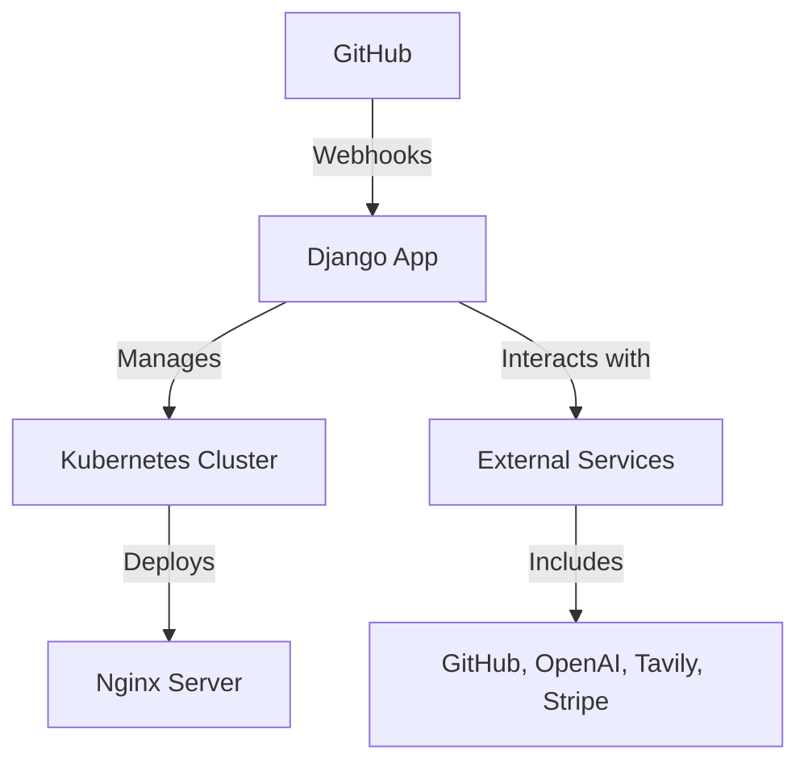

# PR Pilot Architecture

At its core, PR Pilot utilizes a **GitHub app** to facilitate interactions with GitHub repositories. The backbone of PR Pilot is a **Django** application, which is deployed to handle **GitHub webhooks**. For serving static files, PR Pilot employs an **nginx** server. To manage the deployment of the Django application, nginx server, and the execution of jobs, PR Pilot relies on a **Kubernetes cluster**.

## Architecture Diagram

This diagram illustrates the flow of interactions within the PR Pilot architecture, highlighting the central role of the Django application in managing webhooks, deploying services, and interacting with external services.