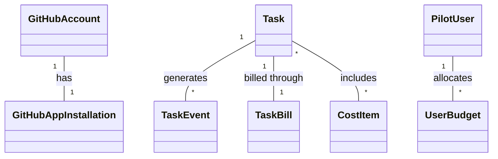

# Domain Model

This document outlines the domain model of PR Pilot, providing insights into the purpose and relationships of the models within the system.

## Models
- **GitHubAccount**: Represents a GitHub user account. Defined in `webhooks/models.py`.
- **GitHubAppInstallation**: Represents an installation of the PR Pilot GitHub app on a user account. Defined in `webhooks/models.py`.
- **Task**: Represents a task that PR Pilot performs, such as processing a command from a GitHub comment. Defined in `engine/models.py`.
- **TaskEvent**: Represents an event that occurs during the execution of a Task. Defined in `engine/models.py`.
- **TaskBill**: Represents the billing information for a Task. Defined in `engine/models.py`.
- **CostItem**: Represents a cost item associated with a Task. Defined in `engine/models.py`.
- **PilotUser**: Represents a user of the PR Pilot system. Defined in `accounts/models.py`.
- **UserBudget**: Represents the budget allocated to a PilotUser for using PR Pilot. Defined in `accounts/models.py`.

## Overview
The domain model of PR Pilot revolves around the concept of Tasks. A Task is created whenever a user interacts with PR Pilot by issuing a command through a GitHub comment. Each Task can generate multiple TaskEvents, which track the progress and actions taken during the Task's execution. TaskBills and CostItems are used to manage the billing and cost associated with executing a Task. The GitHubAccount and GitHubAppInstallation models facilitate the interaction between PR Pilot and GitHub, while the PilotUser and UserBudget models manage the users of the PR Pilot system and their allocated budgets.

