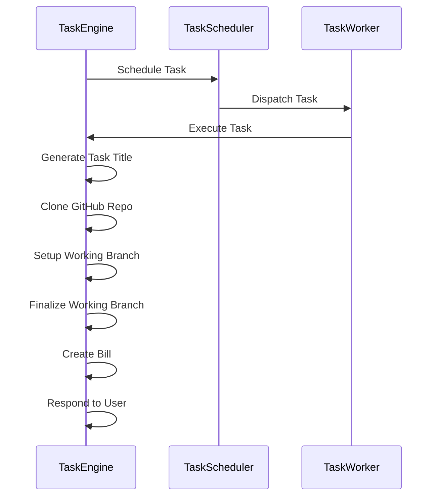

# Task Processing in PR Pilot

The lifecycle of a task within the PR Pilot project involves several key components: `TaskEngine`, `TaskScheduler`, and `TaskWorker`. This detailed explanation expands on the sequence diagram provided in the issue.

1. **TaskEngine Initialization**: The process begins with the `TaskEngine`, which is responsible for the overall management of tasks. It initiates the task lifecycle by scheduling a task based on user requests or automated triggers.

2. **Scheduling the Task**: The `TaskEngine` communicates with the `TaskScheduler`, a component designed to manage the timing and dispatching of tasks. The `TaskScheduler` determines the appropriate time and worker for the task, ensuring efficient workload distribution.

3. **Dispatching to TaskWorker**: Once scheduled, the task is dispatched to a `TaskWorker`. The `TaskWorker` is a dedicated process or thread responsible for executing the task. It performs the required operations, leveraging the project's resources and external APIs as necessary.

4. **Execution and Processing**: After receiving the task, the `TaskWorker` executes it. Upon completion, the task's results are sent back to the `TaskEngine` for further processing. This includes:
   - **Generating the Task Title**: Creating a descriptive title for the task, which is used for logging and monitoring purposes.
   - **Cloning the GitHub Repository**: The `TaskEngine` clones the relevant GitHub repository to access the project's codebase and perform operations.
   - **Setting Up the Working Branch**: It then sets up a working branch within the cloned repository. This branch is used to implement changes without affecting the main codebase directly.
   - **Finalizing the Working Branch**: After the task's operations are completed, the `TaskEngine` finalizes the working branch, preparing it for review and integration into the main codebase.
   - **Creating a Bill**: If applicable, the `TaskEngine` generates a bill for the task. This is relevant for operations that incur costs, ensuring transparency and accountability.
   - **Responding to the User**: Finally, the `TaskEngine` communicates the outcome of the task to the user. This response may include a summary of the actions taken, any changes made, and the status of the task.

This detailed process ensures that tasks are handled efficiently and transparently within the PR Pilot project, from initiation to completion.
