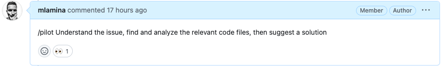
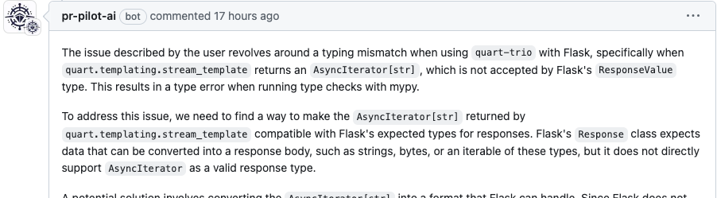
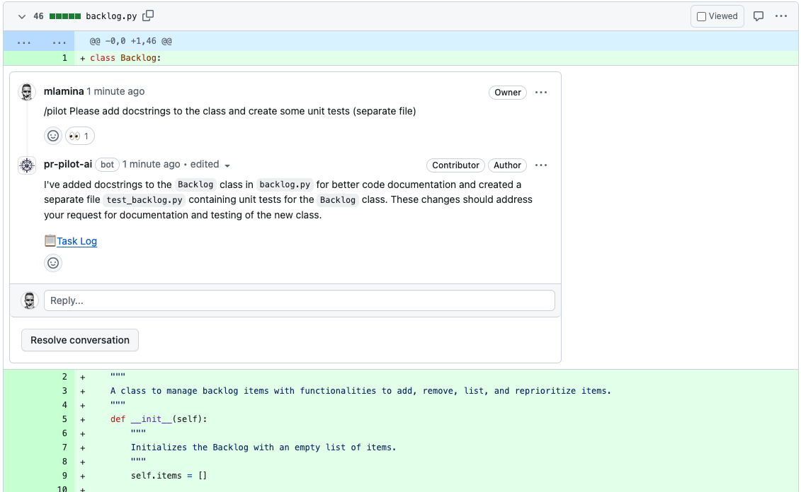
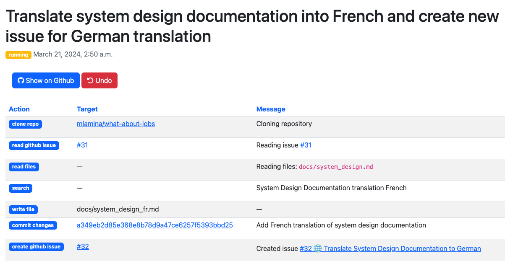
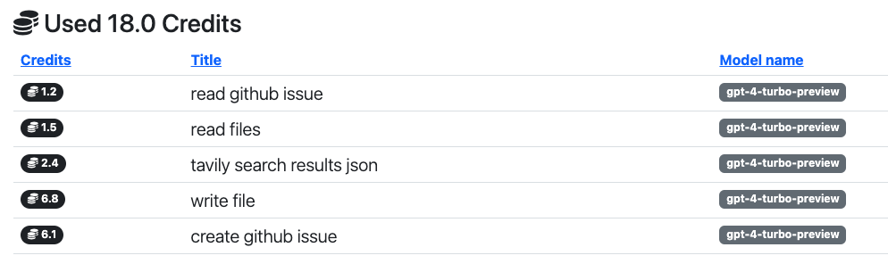
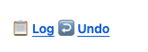
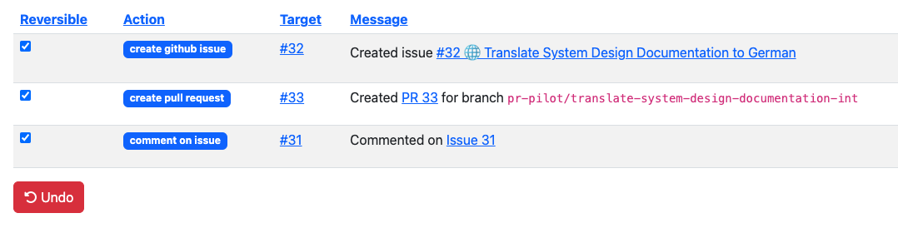
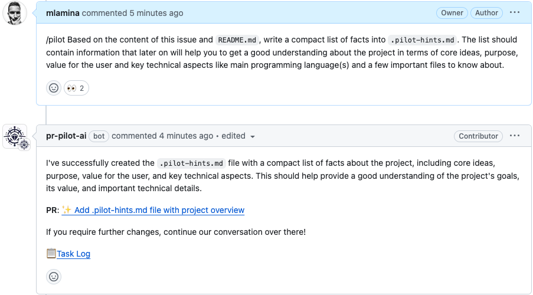

# How it works
**PR Pilot** behaves like any other user on GitHub. It reads and writes to issues and PRs, and communicates with you through comments.

## First: Let's set expectations
To get the most out of the tool and avoid frustration, it's important to understand its current limitations.
**PR Pilot** is currently in **early development**. I am actively collecting feedback and improving the bot.
It works well for small, well-defined tasks. For example:
* [Creating Boilerplate Code](https://github.com/PR-Pilot-AI/pr-pilot-demo-django/issues/1)
* [Sketching out a new project](https://github.com/mlamina/what-about-jobs/issues/1)
* [Refining Tickets](https://github.com/mlamina/what-about-jobs/issues/1#issuecomment-2002192680)
* [Generating Unit Tests](https://github.com/hex337/quantum-attendance/pull/78#issuecomment-1992749255)

It still struggles with complex tasks that require a deep understanding of the codebase or the project's domain:
* [Interpreting vague instructions](https://github.com/mlamina/what-about-jobs/issues/4#issuecomment-1998946675)
* Referring back to previous conversations
* "Knowing" how your commands relate to the project's code and domain

I'm working hard on improving these aspects. Check out the [roadmap](./roadmap.md) to see what's coming next.

## Have a Conversation

To get **PR Pilot** to do something, you just need to say `/pilot <command>` in a comment on an issue or PR.

The bot will add a 👀 reaction to your comment so you know it's working on it.
    
When it's done, **PR Pilot** will respond to you.

## Collaborate
You can also talk to **PR Pilot** in PR reviews.

## Monitor
While a task is running, **PR Pilot** will create events that you can follow in the [dashboard](https://app.pr-pilot.ai/dashboard/tasks/):

You'll also get a detailed overview of how your credits were spent.

## Rollback
If you're not happy with the result, just hit the "Undo" button:

and choose which actions you want to undone:

## Teach
You can "teach" **PR Pilot** by populating a `pilot-hints.md` file in your repository, allowing you to control 
what it "knows" and how it behaves.

