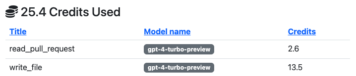

# Pricing

I've always hated it that almost every AI tool out there is subscription based. PR Pilot is different.

## Credit-Based Payment Model

PR Pilot is a credit-based service. You buy credits and use them to run commands. **You decide** when and how much money you want to spend.

## Pay as you go

If you run out of credits, you can buy more with simple one-time payments. No subscriptions, no hidden fees.

> **Note:** PR Pilot is in early development and has no payment implemented yet.

## Free Tier

Right now, every Github user gets **500 credits for free**. This is enough to run a good amount of commands and get a feel for the service.
