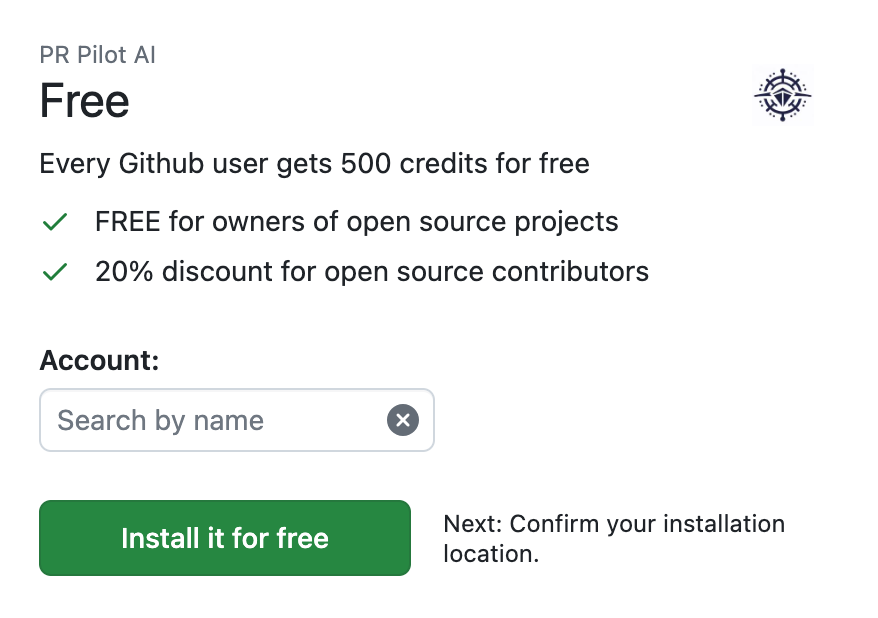

(quickstart)=
# Quickstart

First, [install PR Pilot from the Github marketplace](https://github.com/apps/pr-pilot-ai)

Then say `/pilot <prompt>` in any Github issue or PR comment.

The bot will turn your comment into a link to your [dashboard](https://app.pr-pilot.ai), where you can see what PR Pilot is doing.
