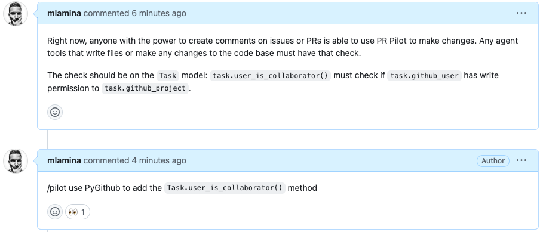
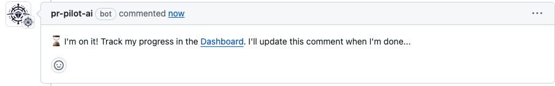
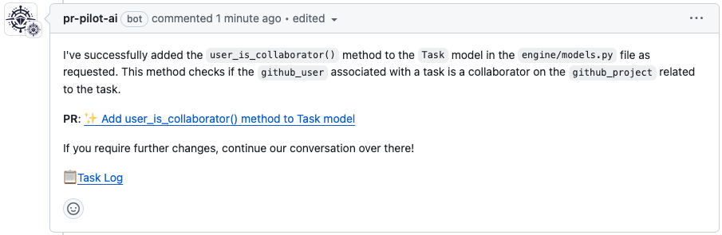

# Vision

**PR Pilot** is made by software developers for software developers. We believe that the future of software development is in the hands of AI and are committed to making it accessible to everyone.

## Our Mission

**Empower developers to utilize the power of LLMs in their daily workflows.**

## The Problems PR Pilot solves

While LLMs are widely accessible by now, they are still not easy to use for the average developer. PR Pilot aims to solve this problem by providing a simple and intuitive interface to interact with LLMs.

### Context-Awareness
Ever tried to use ChatGPT to help you with your code? It's not easy. Most chatbots are not aware of the context of your code and can't provide meaningful help unless you copy/paste the relevant information.
PR Pilot is different. By working directly within your issues and PRs, it has access to all the context it needs to understand your commands and provide meaningful help.

### Seamless Integration
You don't need to switch between your IDE, your browser, and your terminal to get things done. You can treat PR Pilot like an intelligent, 
independent collaborator. All comments and your dashboard pages are interlinked, so you can switch seamlessly between them.

### No Expert Knowledge Required
You don't need to be an expert in prompt engineering or NLP to use PR Pilot. As long as your commands are clear and make sense 
in the context of your issue/PR, PR Pilot will understand and execute them and never lose flow.

### Team Collaboration
PR Pilot is not just for individual developers. It can help your entire team/project by plugging into your existing workflows on Github.

### Beyond Coding
Github CoPilot and similar tools have been groundbreaking for the developer community. 
However, it is limited to the boundaries of your IDE. PR Pilot is not. It can help you with your code, 
your issues, your PRs, browse the web to find information for you [and more](roadmap).

## Values
Over multiple iterations and feedback from users, we've learned some important lessons and tried to incorporate them into PR Pilot.

### Privacy Matters
Developers are protective of their code - and rightly so. We aim for the highest standards of privacy:
* **No persistence** - We never store code permanently. Every `/pilot` command is run in an ephemeral Docker container.
* **Minimal permissions** - You can enable/disable PR Pilot on a per-repository basis. It only has access to the repositories you allow it to access.

### Simplicity is Key
We've learned that the simpler the interface, the more likely developers are to use it. By using Github issues
and PRs as the user interface, we've made it easy for developers to interact with PR Pilot without leaving their familiar environment.

## Keep the Flow
Flow is a state of mind where you are fully immersed in a task. Switching between different tools and interfaces can break your flow.
With PR Pilot, you can stay in the flow and get things done without interruptions.